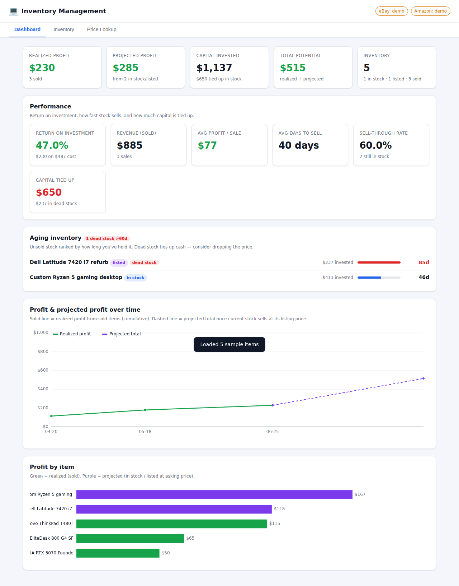

# 💻 Inventory Management — Computer Resale

> **Free edition.** Contact us for access to the pro edition.

A local web app for tracking the computers, laptops, desktops and components you
buy, refurbish and resell. It records **what you paid**, **what you spent to get
each unit working**, tells you **exactly what price you need to turn a profit**,
charts your **profit and projected profit over time**, and pulls **eBay & Amazon
price comparisons** (including recently‑sold prices) so you can price with
confidence.

Built with **zero runtime dependencies** — just Node.js 22 built‑ins
(`node:http`, `node:sqlite`, `fetch`, `node:crypto`). No `npm install`, no native
builds, no CDN. Runs fully offline (live marketplace lookups are the only thing
that needs the internet).



---

## Features

| Your need | How it works |
|-----------|--------------|
| Add laptops, desktops, components & devices | Full item records with category, brand, model, condition and specs (CPU / RAM / storage / GPU / screen / OS). |
| Track what you spent to get it working | Per‑item cost line‑items (parts, labor, shipping, testing, fees) on top of the acquisition cost. |
| See what's needed to turn a profit | Automatic **break‑even sale price** and **suggested price** for your target margin — accounting for marketplace fees, a flat per‑sale fee, and outbound shipping. Clear "raise price by $X" / "you clear break‑even by $X" callouts. |
| Profit & projected profit graph | Dashboard line chart: cumulative **realized** profit from sold items plus a **projected** line for stock you still hold. A per‑item profit bar chart too. |
| eBay & Amazon comparison + recently sold | Search comparables; median/min/max stats feed the profit projection. This build uses the built‑in demo provider and labels every row as simulated — live marketplace APIs are part of the [Pro upgrade](#tech-garage-pro). |
| Physical tracking | Serial number / service tag and a storage location (bin / shelf) per unit. |
| Find things fast | Live search across title, brand, model, serial, location and specs; click any column header to sort. |
| Spot dead stock | An **age** column and a dashboard **aging report** rank unsold stock by days held and flag items past 60 days that are tying up cash. |
| One‑click sell | “Mark as sold” captures the price and date and instantly realizes the profit. |
| Performance reporting | ROI, revenue, average profit per sale, average days‑to‑sell, sell‑through rate and capital tied up. |
| Backup & bulk edit | Export inventory to **CSV**, take a full **JSON backup**, and **import** items from CSV or JSON. |
| Accounts & login | A themed landing page, then a password‑protected login. First run creates the **admin** account; the admin can add more users. |
| Admin API settings | Configure eBay/Amazon API keys and pricing defaults from an **Admin page** — no `.env` editing required. |
| Auto-fill from eBay | Paste an eBay listing URL or item number in the Add-item form and pull the **title, specs (CPU/RAM/storage/GPU/screen/OS), brand, model, condition and price** straight into the form. This build reads the listing's public page; the official Browse API route is part of the [Pro upgrade](#tech-garage-pro). |
| Customer storefront | **Invite** buyers with a link; they see a private shop of your for-sale items showing **only listing price + specs** (never cost/profit), pick **upgrade options** to see the new total, and **request to purchase**. |
| Purchase notifications | Each request is saved in Admin **and** emailed to you over **SMTP** — with the items, upgrades, total, any offer, and the customer's account details. WhatsApp, Discord and Telegram alerts are part of the [Pro upgrade](#tech-garage-pro). |
| Item photos | Upload multiple photos per item (JPEG/PNG/WebP/GIF); the first is the storefront thumbnail. Customers see them in the shop. |
| Cart & offers | Customers add multiple items to a cart and request them together; with 2+ items they can **make an offer** for a lower bundle price. |
| Password recovery | Invited users get a **forgot-password** flow (emailed reset link when email is configured), and admins can reset any user's password directly. |
| Visitor tracking | An Admin **Visitor activity** log shows who's browsing/searching your stock, with browser, OS, screen, timezone and IP. |
| Your site link | Show a link to your own website (e.g. monhe.it) on the storefront. |
| eBay/Amazon condition filter | Search comparables by listing condition — **New, Refurbished, Used, For parts** — so a refurbished unit isn't priced against new retail. The item drawer defaults to the item's own condition. See [Condition filtering](#condition-filtering). |
| Community directory | List your shop alongside other Tech Garages and share individual items with nearby sellers. **The shop list is a file in this repository** — no server to host, publicly auditable, spam-controlled by pull-request review — while every shop serves its own listings, so nobody's stock lives on anyone else's machine. A hosted directory server is available as an alternative. See [The community directory](#the-community-directory). |
| Shopper quality-of-life | A cart that survives a refresh **and follows the account across devices**; the shopper's own **order history** with live status and tracking; category/price/sort filters; shareable item URLs; sold-out items kept visible with "tell me if another arrives"; savings badges; recently-viewed and complementary-item strips; pinch-to-zoom photos; optional guest browsing. See [The storefront](#the-storefront). |
| Order lifecycle | Requests move **sent → reserved → paid → shipped → completed** (or declined/cancelled), each step audited, emailed to the customer, and visible in their history. Offers get an explicit accept / counter / decline answer instead of silence. |
| Store colour schemes | Six built-in themes (Classic Blue, Graphite, Emerald, Sunset, Violet, Crimson), each with a matching light **and** dark palette, applied across the admin portal, inventory app, storefront and public landing page. Setting individual colours is part of the [Pro upgrade](#tech-garage-pro). See [Theming](#theming). |

## Deploy on a Debian server (one line)

For a server — a VM, an LXC container, a VPS — where you want it running as a
service and surviving reboots:

```bash
curl -fsSL https://raw.githubusercontent.com/CyberNerdIT/InventoryManagement-Free/HEAD/deploy-debian.sh | bash
```

Run it **as root**. A stock Debian container image has no `sudo`, and needing to
install one before you can install anything else is a poor first impression.

That single command installs the apt packages the install needs, creates the
unprivileged `invmanage` account the service runs as, installs the app into
`/opt/inventory-management`, bootstraps Node 22 if the distro's is too old,
writes and enables the systemd unit, generates a self-signed TLS certificate,
then waits for `/api/health` to answer and tells you what it said. Open
`https://<server>:3000` — the first visit creates the admin account.

**HTTPS is on by default.** The admin page carries customer names, emails and
phone numbers, and the login guarding it posts a password — none of which
belongs on plain HTTP because a certificate was one extra flag away. The
certificate is self-signed, so a browser warns once and lets you through; for
one browsers trust, use Let's Encrypt and point `TLS_CERT_FILE` /
`TLS_KEY_FILE` at the issued files, or drop them over
`data/tls/{cert,key}.pem`. An existing certificate is never regenerated by a
re-run. Opt out with `--no-tls` (sensible only behind a TLS-terminating proxy).

Options, as flags or the matching environment variables:

```bash
# Name the certificate after your domain, on a custom port
curl -fsSL .../deploy-debian.sh | bash -s -- --port 8080 --tls shop.example

# Point the admin page's Pro section at your own page
curl -fsSL .../deploy-debian.sh | bash -s -- --upgrade-url https://example.com/pro
```

`--port` · `--dir` · `--user` · `--branch` · `--slug` · `--tls CN` ·
`--no-tls` · `--hosted` · `--support-url` · `--upgrade-url` · `--no-start`. Piping needs
`-s --` before flags, because the script is bash's stdin. Run
`deploy-debian.sh --help` for the full list.

Re-running is safe, and is how you re-deploy: packages already present are left
alone, an existing service user is reused, and the app updates in place. Your
database, uploads and TLS material are never touched. For routine updates
afterwards, `/opt/inventory-management/update.sh` is lighter.

If the host has no working systemd (some minimal containers), everything still
installs and the unit file is still written — the script says so and gives you
the command to start it by hand.

## Install (one line, any OS)

For a laptop, a Mac, or anywhere you don't want a system service:

```bash
curl -fsSL https://raw.githubusercontent.com/CyberNerdIT/InventoryManagement-Free/HEAD/install.sh | bash
```

No `curl`? Use `wget` (or `sudo apt-get install -y curl` first on Debian/Ubuntu):

```bash
wget -qO- https://raw.githubusercontent.com/CyberNerdIT/InventoryManagement-Free/HEAD/install.sh | bash
```

The installer itself works with either `curl` or `wget`, and needs neither if
`git` is available.

The installer downloads the app to `~/.inventory-management` and adds an
`inventory` launcher to your `PATH`. Then just run `inventory` and open
<http://localhost:3000>.

**No Node.js 22 yet? No problem.** The app needs Node 22+ for its built-in
SQLite module. If a compatible Node isn't found, the installer sets up a local
copy via [nvm](https://github.com/nvm-sh/nvm) automatically — it doesn't touch
any system Node — and pins the app to that binary. To manage Node yourself
instead, pass `--no-auto-node`.

`HEAD` always resolves to the repository's default branch, so this link keeps
working no matter what the default branch is named.

Useful variants:

```bash
# Install AND start immediately
curl -fsSL https://raw.githubusercontent.com/CyberNerdIT/InventoryManagement-Free/HEAD/install.sh | bash -s -- --start

# Install as an always-on background service (systemd on Linux, launchd on macOS)
curl -fsSL https://raw.githubusercontent.com/CyberNerdIT/InventoryManagement-Free/HEAD/install.sh | bash -s -- --service

# Auto-install Node.js via nvm if it's missing/too old, custom port + location
curl -fsSL https://raw.githubusercontent.com/CyberNerdIT/InventoryManagement-Free/HEAD/install.sh | INV_AUTO_NODE=1 PORT=8080 INV_DIR=~/apps/inventory bash
```

```bash
# Install as root but run the service under an unprivileged user,
# with the app in /opt/inventory-management (owned by that user):
wget -qO- https://raw.githubusercontent.com/CyberNerdIT/InventoryManagement-Free/HEAD/install.sh | INV_SERVICE_USER=invmanage bash
```

Options: `PORT`, `INV_DIR`, `INV_BRANCH` (defaults to the repo's default
branch), `INV_REPO`, `INV_SERVICE=1`, `INV_SERVICE_USER=<name>`,
`INV_START=1`, `INV_AUTO_NODE=1`. Re-running the installer updates in place.

## HTTPS

The server serves **HTTPS automatically** as soon as it finds a certificate and
key — no code or flag changes. It looks for `data/tls/cert.pem` and
`data/tls/key.pem` (override with `TLS_CERT_FILE` / `TLS_KEY_FILE`).

**Local / LAN (self-signed):**

```bash
./gen-cert.sh                 # writes data/tls/{cert,key}.pem (CN=localhost)
systemctl restart inventory   # or: npm start
# open https://localhost:3000  (browsers warn once for self-signed — click through)
```

**Public domain (browser-trusted, Let's Encrypt):**

```bash
sudo apt-get install -y certbot
sudo certbot certonly --standalone -d shop.example.com
# point the app at the issued files (in the systemd unit's Environment=):
#   TLS_CERT_FILE=/etc/letsencrypt/live/shop.example.com/fullchain.pem
#   TLS_KEY_FILE=/etc/letsencrypt/live/shop.example.com/privkey.pem
#   PORT=443            (needs AmbientCapabilities=CAP_NET_BIND_SERVICE in the unit)
#   HTTP_REDIRECT_PORT=80   (optional: 301 plain HTTP → HTTPS)
```

**Behind a reverse proxy** (nginx/Caddy terminating TLS) also works: keep the
app on plain HTTP and the proxy forwarding `X-Forwarded-Proto: https` — the
session cookie is automatically marked `Secure`. Either way, once you're on
HTTPS the login cookie becomes `Secure` and all links the app generates
(invites, password resets) use `https://`.

## Quick start (from a clone)

```bash
# Requires Node.js >= 22.5 (for the built-in node:sqlite module)
node --version

# Start the app
npm start
# → open http://localhost:3000
```

**First run:** open the app and you'll land on a marketing page → **Sign in** →
a one‑time **setup screen** to create your admin account. After that you're in
the inventory dashboard. Click **“Load sample data”** to populate a few example
machines, or **“+ Add item”** to enter your own.

### Accounts, login & the Admin page

- Visiting `/` shows a **landing page**; `/login` is the sign‑in form; the app
  itself lives at `/app` and every `/api/*` call requires a valid session.
- The **first** account you create is an **admin**. Admins get an **Admin**
  link (top‑right) at `/admin` where you can:
  - set the **eBay / Amazon API credentials** and **pricing defaults**
    (fee rate, flat fee, target margin) — stored in the database, overriding
    any `.env` values, with secrets never sent back to the browser;
  - **add / remove users** and reset passwords.
- Passwords are hashed with **scrypt**; sessions are opaque, HttpOnly cookies.

#### Customer storefront (invite-only)

- In **Admin → Customer invites**, generate a link and share it. The recipient
  opens it, sets their own password, and gets a **customer** account.
- Customers land on `/shop` (never the internal app or `/api/*` data endpoints —
  those return `403` for customers). They see only **for-sale items** (in stock
  or listed, with a price) showing **title, specs, condition, and your listing
  price** — no cost, break-even, or profit ever.
- Add **upgrade options** to any item (in its drawer, "Customer upgrade
  options"): a label + extra price. Customers tick them to see the new total.
- **Request to purchase** creates a record in **Admin → Purchase requests** with
  the item, chosen upgrades, total, and the customer's name/username/email/phone,
  and (if SMTP is configured) emails it to you. The request is stored first
  either way, so nothing is ever lost when a notification fails.
  - Chat alerts — **WhatsApp, Discord and Telegram** — are part of the
    [Pro upgrade](#tech-garage-pro). Their credential fields are still on the
    Admin page and still save, so an install that upgrades later has nothing to
    re-enter; until then a channel you switch on is reported as needing the
    upgrade rather than silently doing nothing.
- **Stock &amp; availability alerts** reach customers over **email**. A signed-in
  customer subscribes to a specific item or to any new stock (the 🔔 on the
  storefront) and is mailed when it changes. Pushing the same alerts over
  WhatsApp is part of the Pro upgrade.
- **Share a listing publicly.** Each storefront card has a 🔗 **Share** button that
  copies a public link (`/s/<id>`). Anyone can open it — logged out — to see a
  minimal teaser (photo, title, category, condition) with pricing and full specs
  hidden behind a **"Reveal full details"** call to action that signs them up for
  the waitlist.
- The server binds to localhost by default. To reach it from other machines,
  put it behind a reverse proxy with HTTPS (the session cookie is automatically
  marked `Secure` when it sees `X‑Forwarded‑Proto: https`).

There is nothing to install — `npm start` just runs
`node --experimental-sqlite src/server.js`. Data is stored in a local SQLite
file at `data/inventory.db` (created automatically, git‑ignored).

```bash
npm test   # run the profit/break-even unit tests
npm run dev # start with --watch auto-reload
```

## How the money math works

For each unit:

```
invested cost = acquisition cost + Σ(refurbishment costs)
net proceeds  = sale price − sale price × feeRate − flatFee − shipping
profit        = net proceeds − invested cost
```

* **Break‑even sale price** = `(invested + shipping + flatFee) / (1 − feeRate)`
  — the price at which profit is exactly zero.
* **Suggested price** hits your target margin:
  `(invested + shipping + flatFee + margin × invested) / (1 − feeRate)`.
* **Realized profit** is computed once an item's status is `sold`.
* **Projected profit** for unsold stock uses your asking price, or falls back to
  the median recently‑sold market comp when you run a price check.

Fee assumptions default to eBay's typical ~13.2% final‑value fee + $0.30, and a
25% target margin. Every item can override the fee rate, flat fee, shipping and
target margin individually, and the global defaults live in `.env`.

## eBay & Amazon price comparison

The app ships with a **demo price provider**, so the comparison feature works
out of the box with realistic sample comps. **Every row is labelled as
simulated**, and demo numbers are never mixed into live results or allowed to
drive a pricing decision — a demo median silently becoming your market estimate
is a bug this codebase has already had once.

**Live marketplace lookups are part of the [Pro upgrade](#tech-garage-pro)** and
this build contains no code that can call either API:

* **eBay** — active listings via the Browse API, recently‑sold prices via
  Marketplace Insights (which eBay gates behind a separate approval).
* **Amazon** — the Product Advertising API v5. Amazon does not publish
  sold‑price history the way eBay does, so it contributes active comps only.

The credential fields for both are still on the Admin page (and in
`.env.example`) and still save. Storing a key is not implementing an
integration, and keeping them means an upgrade needs no re-entry.

### Auto-fill from an eBay listing

Add item → paste a listing URL or item number → *Fetch details*. This build
reads the listing's **public page** (JSON‑LD plus the rendered item specifics).
It needs no credentials, which is why it is here — but it is against eBay's
Terms of Service, it is fragile, and it yields fewer specs than the API. Servers
are also blocked more often than browsers are, so a lookup can come back with a
bot-check page rather than a listing.

The official route — the Browse API's `getItemByLegacyId`, which is structured
and ToS-compliant — is part of the Pro upgrade, and none of that client code is
in this repository.

## API

All endpoints are JSON under `/api`.

| Method & path | Purpose |
|---|---|
| `GET /api/config` | Provider status + default fee assumptions (no secrets). |
| `GET /api/items` `?status=&category=` | List items. |
| `POST /api/items` | Create an item. |
| `GET /api/items/:id` | Item + costs + computed financials. |
| `PUT /api/items/:id` | Update an item. |
| `DELETE /api/items/:id` | Delete an item (and its costs). |
| `GET /api/items/:id/financials` `?market=` | Financials only (optional market estimate). |
| `POST /api/items/:id/costs` | Add a refurbishment cost. |
| `DELETE /api/costs/:id` | Remove a cost. |
| `POST /api/items/:id/sell` | Mark an item sold (`{sold_price, sold_date}`). |
| `POST /api/ebay/listing` | Auto-fill item fields from an eBay listing (`{url}` or `{itemId}`); needs eBay credentials. |
| `GET /api/shop/catalog` | Everything the storefront needs in one round trip: items, categories, saved cart, recently viewed, condition wording. |
| `GET /api/shop/items` | Customer-safe items for sale (price + specs only). |
| `GET /api/shop/item/:id` | One item plus complementary stock for the "you might also need" strip. |
| `GET /api/shop/cart` · `PUT` · `DELETE` | The saved cart. `PUT` re-validates every line against live stock and prices. |
| `GET /api/shop/requests` | The shopper's own order history, with status, tracking and offer decision. |
| `GET /api/health` | Build, `edition` (free / hosted) and the `upgrade` catalogue. Public. |
| `GET /api/directory/verify` | Public: returns this node's id, so a directory or reviewer can confirm you control this URL. |
| `GET /api/directory/profile` | Public: how a shop introduces itself, including who it recommends (only if it opted in). |
| `GET /api/directory/invite` | Public: this shop's `TG1.…` invite code — what the `/connect` link resolves to. |
| `POST /api/admin/directory/connect` | Connect using another shop's link (`{link}`); the server reads their invite from it and verifies the shop before trusting it. |
| `GET /api/admin/directory/connections` | Refresh connections: reachability, mutuality, and friend-of-friend suggestions. |
| `POST /api/admin/directory/dismiss` | Stop suggesting a shop. |
| `GET /api/shop/friends` | The "shops we work with" row for the storefront. |
| `GET /api/directory/listings` | Public: this shop's own shared listings. What makes the repo-backed registry federated. |
| `GET /api/admin/directory/entry` | The pre-validated registry block to paste into a pull request. |
| `GET /api/admin/directory/registry` | Who else is currently listed, and which are near you. |
| `GET /api/admin/directory` · `PUT` | Directory settings, shared listings and known peers. |
| `POST /api/admin/directory/register` | Announce (or re-ping) this shop. |
| `POST /api/admin/directory/sync` | Publish every item ticked for sharing. |
| `POST /api/admin/directory/peers` · `DELETE /:node` | Add, trust, block or remove another shop. |
| `GET /api/shop/nearby` | Community listings for the storefront strip (cached, sanitized). |
| `GET /api/shop/public` | Read-only catalogue for signed-out visitors (403 unless guest browsing is on). |
| `POST /api/admin/requests/:id/offer` | Answer an offer: `{decision: accepted\|countered\|declined, note}`. |
| `GET /api/admin/storefront` · `PUT` | Condition wording + shopper options (guest browsing, order emails). |
| `POST /api/shop/requests` | Customer request to purchase (`{itemId, upgradeIds, message}`). |
| `POST /api/items/:id/upgrades` · `DELETE /api/upgrades/:id` | Manage an item's upgrade options. |
| `POST /api/admin/invites` · `GET`/`DELETE` | Create/list/revoke customer invite links (a redeemed invite always creates a *customer*). |
| `GET /api/admin/requests` · `PUT /api/admin/requests/:id` | View purchase requests / mark handled. |
| `GET /api/invite/:token` · `POST /api/invite/:token/accept` | Validate / accept a customer invite (public). |
| `POST /api/items/:id/pricing` | Search comps for this item, store them, return updated financials. |
| `GET /api/pricing/search?q=&sources=ebay,amazon&condition=` | Ad‑hoc comp search. `condition` is one of `any\|new\|refurbished\|used\|parts`. |
| `GET /api/analytics/summary` | Portfolio rollup (invested / realized / projected). |
| `GET /api/analytics/report?staleDays=60` | ROI, sell‑through, days‑to‑sell, dead‑stock aging. |
| `GET /api/analytics/profit-series` | Time series for the profit chart. |
| `GET /api/export/items.csv` | Download inventory as CSV (with computed financials). |
| `GET /api/export/backup.json` | Download a full JSON backup (items + costs). |
| `POST /api/import` | Import items (`{items:[...]}` or a JSON array; nested `costs` supported). |
| `POST /api/seed` | Load sample data (only into an empty inventory). |
| `GET /api/theme.css` | The generated colour-scheme stylesheet (public — it themes the login and landing pages too). |
| `GET /api/admin/theme` | Current theme, plan, the available presets, and the active preset's base palette. |
| `PUT /api/admin/theme` | Set `{preset, mode}`. A `custom` payload is rejected with a 400 — see [Custom colours](#custom-colours). |

## Theming

Every colour in the UI comes from a CSS custom property, so a theme is just a
small palette. The server generates it at **`/api/theme.css`**, which every page
links right after `style.css` — a real stylesheet in `<head>`, so the theme is
applied before first paint and there is no colour flash.

Pick a scheme in **Admin → Site & branding → Colour scheme**. Each of the six
presets ships a light and a dark palette; *Appearance* decides whether visitors
follow their device's light/dark setting or always get one of them.

Profit green, loss red and warning amber stay the same across all presets on
purpose — they carry meaning, not decoration, and a red "profit" figure would be
actively misleading.

### Custom colours

The six presets are the whole of theming in this build. Setting individual
colours is part of the [Pro upgrade](#tech-garage-pro): `PUT /api/admin/theme`
rejects a `custom` payload with a 400, and nothing is stored, because there is
no validator here that could tell a hex code from a script tag.

## Tech Garage Pro

A handful of features are not part of this build. **They are absent, not
disabled** — there is no code for them anywhere in this repository, which is why
nothing in the app asks you for a licence key, an activation code or an account.
An install can only *report* what it is; it cannot be mistaken about it, and
there is no field for a user to get right or wrong.

### What Pro adds

| Feature | What it is |
|---|---|
| Custom store colours | Set any of the twelve theme variables instead of picking a preset |
| eBay price lookups | Real sold and active comps, with condition filtering |
| Amazon price lookups | Current offers via PA-API |
| WhatsApp / Discord / Telegram alerts | Purchase requests pushed to a chat channel |
| Community controls | Show only invited shops, or hide the community strip |

The same list is served from the app itself — the **Pro upgrade** section of the
Admin page, and `GET /api/health` — so an install can always say what it is
missing without containing any of it.

### How to upgrade

**Not automatically, yet.** The intended path is a key you paste in, after which
the app fetches the premium modules from GitHub and installs them itself. That
machinery is still being built, so this build promises nothing it cannot do:

- the admin page shows what Pro adds and says plainly that upgrading is arranged
  by getting in touch;
- there is **no** key field, no "unlock" button and no half-wired installer
  waiting to be discovered;
- set `INV_UPGRADE_URL` and the page links there instead. Leave it unset and it
  simply says to get in touch — an empty setting is a valid answer, never a
  broken link.

When the key-based installer lands it will be its own script, with its own rules
about which host a secret may be sent to. Deliberately not folded into
`update.sh`: a bad token must never be able to break the thing that ships bug
fixes.

### What this build does instead

Nothing fails, and nothing pretends:

- **Price lookups** use the deterministic demo provider and label every row as
  simulated. Demo numbers are never mixed into live results and never drive a
  pricing decision — see [Provenance](#ebay--amazon-price-comparison).
- **Filling an item from an eBay URL** works via the public-page scraper. That
  path needs no credentials and no API, so it is genuinely part of this build.
  The Browse API route, and the code that maps its response, are not here.
- **Notifications** go out over **email (SMTP)**. Email is core, never premium —
  password resets and welcome mail are how the app functions at all. A chat
  channel you switched on is reported as needing the upgrade rather than
  silently vanishing from the list.
- **Colour schemes** are the six built-in presets, each with a matching light
  and dark palette.
- **Community listings** from other shops are shown. Turning strangers off is
  the Pro control.

Credential fields for eBay, Amazon, WhatsApp, Discord and Telegram are still on
the Admin page and still save. Storing a key is not implementing an integration,
and keeping them means an install that upgrades later has **nothing to
re-enter**. The page marks them as needing the upgrade rather than leaving you
to wonder why nothing happens.

### Where the line is drawn

A paid feature's code is **entirely** absent. Not the sender with the payload
builder left behind, not the merge with the colour list left behind — all of it.
This repository contains no WhatsApp payload format, no Meta error-code table,
no eBay condition ID, no Amazon PA-API request, and no list of which colours are
overridable.

Three things legitimately stay and are not exceptions to that:

- **Credential fields** — storing an eBay key is not implementing eBay.
- **Shared vocabulary** — what "refurbished" means to a reseller is the app's
  idea; how each marketplace *spells* it belongs to those integrations.
- **The catalogue** of what Pro adds — descriptions only, so an install can say
  what it's missing.

`test/editionBoundary.test.js` enforces this rather than trusting it. It scans
`src/` and `public/` for paid-feature fingerprints, asserts there is no `pro/`
directory and no dynamic import that could load one, and checks that nothing has
grown a licence key or an expiry check.

This is enforced because the intention already failed once: "keep the pure,
unit-tested helpers in core" sounded reasonable and left two features almost
entirely in the public repo, with only a `fetch()` missing.

### Running it as a hosted product

`INV_HOSTED=1` marks an instance **you** operate:

```
INV_HOSTED=1
INV_SUPPORT_URL=https://your-support-desk.example
```

`install.sh` bakes both into the systemd unit when they are set, so a fleet
instance is provisioned by the same script as everything else.

**It grants nothing.** It cannot unlock a feature, because no feature here is
locked — the code isn't present. All it changes is advice: a hosted customer has
no shell, so "run `sudo update.sh`" is a dead end and the UI points at support
instead. Someone who sets it on their own box gets *fewer* controls and no extra
features, which is why it needs no defending, and why the whole thing stays this
small. The tests assert exactly that, for every truthy value someone might try.

`GET /api/health` reports `edition` and `upgrade`, so a fleet dashboard can see
what every instance is without asking it anything.

### There is no payment or licence handling in this app

No Stripe, no PayPal, no signed-licence system, no payments table, no call home.
The app has no opinion about who paid, and deciding that happens outside the
software. Nothing here can disable itself, either — software that has to check
in needs a server, and a server can be blocked, spoofed, or simply go down and
take a shop offline with it.

## Condition filtering

Condition is a search input, not a display detail. Comparing a refurbished
machine against new-retail listings raises the market estimate, and the market
estimate feeds the projected profit — so the wrong condition quietly overstates
what you expect to make.

The **Price Lookup** page and the item drawer both carry a condition dropdown:

| Group | eBay condition IDs | Amazon PA-API |
|---|---|---|
| Any | *(no filter)* | `Any` |
| New | 1000, 1500, 1750 | `New` |
| Refurbished | 2000, 2010, 2020, 2030, 2500 | `Refurbished` |
| Used | 3000, 4000, 5000, 6000 | `Used` |
| For parts / not working | 7000 | `Used` * |

\* PA-API has no salvage condition, so that row is filtered locally after the
search rather than server-side.

eBay filters server-side but is not always strict on broad queries, so results
are re-checked locally too (`matchesCondition`). Rows with **no** condition
label are kept rather than dropped — discarding real comps because a
marketplace omitted a field would skew the median worse than including them.

Opening an item's drawer defaults the dropdown to that item's own condition, so
the honest comparison is the one you get without thinking about it.

## The storefront

The shop is the half of the app a customer sees, and it is deliberately narrow:
`toShopItem` is a **whitelist**, so a cost or margin can only reach a buyer if
someone adds the field on purpose. A test asserts that list, and a second one
proves the acquisition cost cannot appear even inside a derived number.

### The cart

The cart is mirrored to `localStorage` (instant, survives a reload) and to the
server (survives a device change). The server copy is authoritative and
**re-validates every line on save**: prices, upgrades and availability are
re-read from live stock, so a cart restored days later can never quote a stale
figure or check out something that has since sold.

### Order history

`GET /api/shop/requests` returns the shopper's own requests, scoped by
`customer_id` **in the query** rather than filtered afterwards. Each carries the
current status, a plain-English explanation, any tracking number, the answer to
their offer, and the full audit trail of when things changed.

Statuses form a real state machine (`src/services/orders.js`): a request can
only move forward, terminal states are final, and rows created before the
lifecycle existed (`handled`) are still movable rather than stranded.

### Prices, savings and market comparison

Two independent claims, kept apart:

- **Savings** come from the item's own `compare_at_price` — a "was" price you
  set. No badge is shown if it isn't actually higher than the asking price.
- **Market comparison** comes from real eBay comps, cached per item in
  `market_snapshots`. The storefront never triggers a live marketplace call at
  render time; the cache is written whenever you check market prices from the
  item drawer.

Demo comps are stored but **never shown to a shopper**. Telling a buyer
"similar units sell for $520" on the strength of simulated data would be
inventing a fact about the world. Sold comps are also worded differently from
active listings, because "recently sold for" is a far stronger claim than
"are listed at".

### Guest browsing

Off by default — whether to show prices publicly is a business decision, not a
default anyone should inherit. When enabled (Admin → Storefront), signed-out
visitors get the catalogue through `/api/shop/public`, which reuses the same
sanitized shape, so a guest can never see a field a customer couldn't.
Requesting a purchase still requires an account.

## The community directory

Shops can list themselves alongside other Tech Garages and publish individual
items, so a customer looking for an SSD you don't stock finds one at a shop
nearby instead of leaving empty-handed.

### The repo *is* the directory

The shop list and the stock are different problems, and they want different
homes:

|  | Shop list | Listings |
|---|---|---|
| Changes | when someone joins | every sale, every price edit |
| Size | small | unbounded |
| Lives in | **`directory/nodes.json` in this repo** | **each shop's own server** |

So the repository answers *who exists*, and every shop answers for its own
inventory at `GET /api/directory/listings`. Nobody's stock sits on anyone else's
machine, and a price change needs no commit anywhere.

That buys three things a hosted directory can't: **nothing to host**, a shop
list that is **publicly auditable** (every shop ever added is a reviewable diff
with a name attached), and **spam control that actually works** — a human merges
the pull request.

The costs are real, and `directory/README.md` states them plainly: joining takes
a review rather than seconds, showing nearby stock means talking to several
shops instead of one, and **a registry entry is public and permanent in git
history**. Removing your entry removes it from the current file, not from past
commits.

### Joining

1. **Admin → Community directory.** Set your region, enable it, press **Copy
   registry entry** — the JSON block is generated and pre-validated for you.
2. Confirm `https://your-shop/api/directory/verify` returns your node id.
3. Open an issue with the *Add my shop* template, or send a pull request.

CI (`.github/workflows/directory.yml`) validates schema, duplicates and regions
on every change, and on pull requests also fetches each shop's verify endpoint
to confirm ownership. Run it yourself with `node tools/validate-registry.js
--live`.

### Prefer a server? That still works

`tools/directory-server.js` is a complete zero-dependency directory on the same
`node:http` + `node:sqlite` stack. Switch *Directory mode* to **Hosted directory
server** and point shops at it — joining is instant and neighbours are one fetch
away, at the cost of keeping a server up.

```
node tools/directory-server.js                    # :4000, ./data/directory.db
DIR_VERIFY_DOMAIN=false node tools/directory-server.js   # local testing only
```

### What is published, exactly

`buildListingRecord` in `src/services/directory.js` is a whitelist, and it is
the only way a listing can leave — the same function serves `/api/directory/
listings` and pushes to a directory server, so there is one definition of what
a stranger sees:

| Published | Never published |
|---|---|
| title, category, condition, brand, model | acquisition cost, refurb costs, fees, margin, break-even |
| price, currency, quantity | serial number, storage location, private notes |
| a link back to **your** shop, a photo URL on **your** server | compare-at price, sold price, target margin |
| coarse region: country / state / town | anything at all about customers |

A test asserts the exact key list; another greps the serialized payload for each
secret value.

### Region is coarse on purpose

Country, state, town, optionally a postcode *prefix*. No street, no coordinates
— "roughly near me?" doesn't require knowing where your garage is, and it is
never guessed from an IP address. An invalid country code is **dropped rather
than truncated**: chopping "AND" to "AN" would quietly file an Andorran shop
under Netherlands Antilles and nobody would notice.

### Identity and trust

Each shop generates an **Ed25519 keypair** the first time the directory is
enabled; the public half *is* its identity, and it is never regenerated (that
would orphan every listing).

- In **repo mode** the key is what a registry entry claims, and
  `/api/directory/verify` is what proves the claim. A shop whose served node id
  doesn't match the registry has its listings **ignored**.
- In **server mode** every write is additionally signed over a timestamped
  envelope, so nobody can publish or delist as your shop and a captured request
  can't be replayed.

### What comes back is untrusted

Remote listings are other people's text landing on a customer's screen.
`sanitizeRemoteListing` clamps every field and rejects any non-`http(s)` URL — a
`javascript:` image src would otherwise be an injection — the shop name comes
from the **registry**, not from the response, and every link is
`target="_blank" rel="noopener nofollow external"`.

The strip only shows categories you **don't** stock: sending a customer to a
competitor for something on your own shelf is the opposite of useful.

### Connections: friends, and the shops they vouch for

The directory answers *who exists near me*. Connections are the layer on top:
shops you deliberately link to, whether they linked back, and — the part that
makes it a network rather than a list — the shops your friends recommend.

**An invite is a link, not a key.** Every shop has a shareable page at
`/connect`. Send someone that link; they paste it into Admin → Community
directory, and their server asks your shop for its own invite rather than
making anyone copy a `TG1.…` blob between browsers. Connecting is still
verified: the app fetches the shop's profile and confirms the URL really is the
node it claims, because a link can be forwarded by anyone.

**Mutual connections are distinguished.** Adding a shop is one-way. `↔ connected`
means they listed you back; `→ following` means they haven't — or keep their
list private, which is reported as *unknown* rather than guessed, because we
genuinely can't tell.

**Friend-of-friend suggestions.** If Ann connects to Bob and Bob connects to
Carol, Ann is shown *"Carol's Components — vouched for by Bob's Bits"*. Two
connections vouching for the same shop ranks it higher. A shop you trust
vouching for another is a far better signal than proximity alone. Suggestions
can be dismissed permanently.

**Publishing your connections is opt-in.** Who you do business with is your
information. A shop that keeps its list private participates fully — it just
doesn't contribute suggestions, and its own profile omits the field entirely
rather than reporting an empty list.

Customers see connected shops as a **"Shops we work with"** row on the
storefront, with mutual partners first — distinct from the item strip, because
"who we work with" and "here's a thing you could buy" read very differently.

### Strangers, and the control that isn't here

Community listings are **on by default** — a community that only works once
everyone opts in doesn't work. Connected shops always outrank strangers, and are
asked even when far away.

Turning strangers off entirely while keeping your connections, or hiding the
strip altogether, is part of the [Pro upgrade](#tech-garage-pro). The toggles
stay visible on the Admin page, disabled, so it is obvious what upgrading buys
rather than the option simply not existing.

## Project layout

```
src/
  server.js              HTTP server + REST routing + static file serving
  config.js              Env/config loader (.env via process.loadEnvFile)
  db.js                  node:sqlite schema (items, costs, price_comps)
  repo.js                Data access + analytics/time-series
  upgrade.js             What the Pro upgrade adds — a catalogue of names and
                         descriptions, and nothing executable (unit-tested)
  edition.js             What this install IS: free, or hosted by us. Observed
                         from the environment, never entered (unit-tested)
  services/
    profit.js            Break-even / suggested price / profit math (unit-tested)
    analytics.js         Aging + performance reporting (ROI, sell-through, dead stock)
    directory.js         Community payload whitelist + signing + region (unit-tested)
    registry.js          Repo-backed shop list: validation + peer selection (unit-tested)
    social.js            Invites, profiles, mutuality, friend-of-friend (unit-tested)
    directoryClient.js   Outbound calls to a directory (best-effort, never blocking)
    orders.js            Purchase-request state machine (unit-tested)
    notify.js            Purchase alerts + customer mail (email only in this build)
    ebayListing.js       Auto-fill from a listing's public page (no API, no keys)
    theme.js             The six colour schemes (unit-tested)
    pricing/
      index.js           Orchestrator: query providers, compute stats, tag provenance
      conditions.js      New/refurb/used vocabulary shared by every provider
      demo.js            Deterministic offline demo comps
public/
  index.html, css/, js/  Vanilla-JS frontend + custom canvas charts
deploy-debian.sh         One-shot server deploy: apt deps, service user, TLS,
                         health check (delegates to install.sh for the app)
install.sh               One-line installer (+ optional systemd/launchd service)
update.sh                Pull the latest release and restart, in place
directory/
  nodes.json             The community shop list — the directory itself
  schema.json            JSON Schema for an entry
  README.md              How to join, and what it costs
tools/
  directory-server.js    Runnable reference community directory (server mode)
  validate-registry.js   CI check for directory/nodes.json (schema + ownership)
test/
  profit.test.js         node:test unit tests for the money math
  editionBoundary.test.js  Proves this build contains no premium code, no module
                         loader, and no licence check
```

## License

MIT
